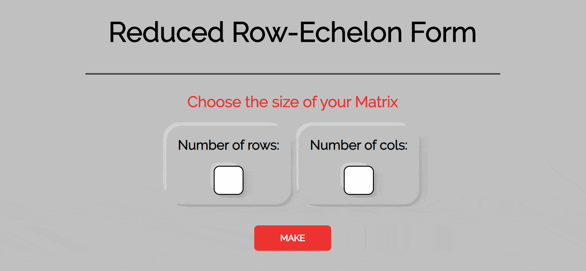

# rref-calculator
## About
This reduced row echelon form (RREF) calculator can receive matrices up to a size of 7 rows by 7 columns. It will take a user specified matrix size and inputs, then outputs it in RREF. In mathematics, solving a matrix and transforming it into RREF is essentially solving a system of linear equations. This has many use cases in advanced mathematics across several disciplines such as finance and differential equations. This project was created using HTML, CSS, and vanilla JavaScript.

## Usage

## Features
- Simplifies a matrix into RREF(reduced row-echelon form)
- Max size 7 rows by 7 columns
- Max input for values is 99
- Min input for values is -99

## Notes
After searching, this seems to be the only front-end RREF calculator on github(so far)! I was inspired to create this from my mathematics studies at UC Riverside, specifically linear algebra courses and the many matrices I had to simplify into RREF. 